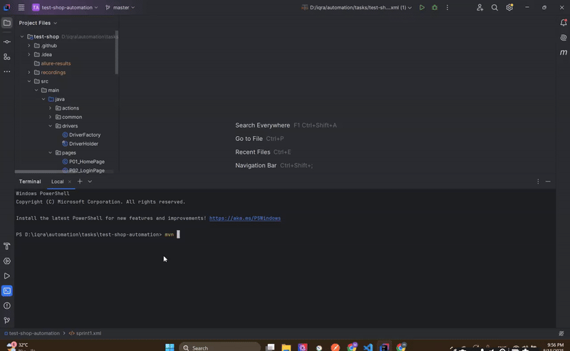

# 🛍️ Test Shop

> A lightweight eCommerce automation testing project based on a local React application.  
> 🔗 GitHub Repo: (https://github.com/moaazawwad/test-shop)

---

## 📋 Table of Contents

- [Overview](#overview)
- [Key Features](#key-features)
- [Setup](#setup)
- [Local Testing Execution Example](#local-testing-execution-example)
- [Contribute](#contribute)
- [License](#license)

---
## 🔍 Overview

**Test Shop** is a Selenium + TestNG automation framework for a local **React** e-commerce app.  
It focuses on realistic user journeys across the store.

---

## What’s Tested

| # | Scenario | Description |
|---|----------|-------------|
| 1 | 🆕 User Registration & Login | Dynamic signup, logout, and login using same data |
| 2 | 🔎 Product Search | Search for “Nike” and assert correct results |
| 3 | ❤️ Wishlist | Add random items and verify on wishlist page |
| 4 | 🛒 Cart & Checkout | Add items to cart, remove some, fill shipping & payment info (Stripe test card) |
| 5 | 💱 Currency Switch | Switch to EUR and validate currency symbols updated |

##  Setup

> This project depends on a **local React frontend**. Make sure it’s running before executing automation tests.

### 1. Run the React App

```bash
cd path-to-your-react-app
npm install
npm run dev
```

It should be available at: `http://localhost:5173/`


### Local Testing Execution Example



###  Run the Automation Tests

```bash
cd test-shop
mvn clean verify
```

##  Contribute

Have improvements or ideas? Fork the repo, open issues, or submit a PR!

---

##  License

MIT License © 2025 Moaaz Awwad
